# LifePilot — Complete Domain Model Reference

> Version: 0.1.1 · Generated: June 2026
> Source of truth: `src/types/index.ts` · Schema: `src/storage/db.ts`

---

## 1. Complete Domain Model

LifePilot is organised into **10 functional domains** across **2 schema versions**.

| Version | Domain | Purpose |
|---------|--------|---------|
| v0.1.0 | **Core** | Pilot identity, settings, language preference |
| v0.1.0 | **Flight Plan** | Goal setting and tracking |
| v0.1.0 | **Flight Log** | Journalling, mood, and reflections |
| v0.1.0 | **Future Me** | Vision, milestones, and time-capsule letters |
| v0.1.0 | **Competency & Growth** | Skills, practice, and evidence |
| v0.1.0 | **Missions & Achievements** | Challenges, completions, and rewards |
| v0.1.0 | **Habits** | Habit formation and streaks |
| v0.1.0 | **Career Explorer** | Career discovery and exploration |
| v0.1.0 | **Money Quest** | Financial literacy concepts and progress |
| v0.1.0 | **Life Choices** | Values-based scenario decision making |
| v0.1.0 | **Co-Pilot & Conversations** | Parent/guardian companion layer |
| v0.1.0 | **Life Projects & Roles** | Long-form projects and identity roles |
| v0.1.0 | **Culture & Timeline** | Cultural stories and personal history |
| v0.1.1 | **Content** | Structured content catalogue |
| v0.1.1 | **Learning Paths** | Curated learning sequences |
| v0.1.1 | **Premium** | Subscription plans and monetisation hooks |
| v0.1.1 | **Achievement+** | Badges and certificates generated by achievements |
| v0.1.1 | **Family** | Parent–child joint challenges |
| v0.1.1 | **School** | Institutional deployment (schools) |
| v0.1.1 | **Enterprise / CSR** | Multi-tenant organisational deployment |
| v0.1.1 | **AI** *(reserved)* | Conversation, recommendations, and insights |

---

## 2. All Entities & Fields

### CORE (v0.1.0)

#### Pilot
| Field | Type | Notes |
|-------|------|-------|
| id | number? | Auto-increment PK |
| name | string | Display name |
| avatarUrl | string? | Profile image URL |
| dateOfBirth | Date? | Used for age-gating content |
| grade | string? | School grade |
| school | string? | School name (free text) |
| city | string? | Location |
| bio | string? | Short biography |
| isActive | boolean | Active profile flag |
| createdAt | Date | |
| updatedAt | Date | |

#### Settings
| Field | Type | Notes |
|-------|------|-------|
| id | number? | Auto-increment PK |
| pilotId | number | FK → Pilot |
| theme | ThemeMode | light / dark / system |
| fontSize | "small" \| "medium" \| "large" | |
| notificationsEnabled | boolean | |
| soundEnabled | boolean | |
| hapticEnabled | boolean | |
| dashboardLayout | string | Serialised layout config |
| createdAt | Date | |
| updatedAt | Date | |

#### LanguagePreference
| Field | Type | Notes |
|-------|------|-------|
| id | number? | Auto-increment PK |
| pilotId | number | FK → Pilot |
| language | SupportedLanguage | |
| updatedAt | Date | |

---

### FLIGHT PLAN (v0.1.0)

#### FlightPlanGoal
| Field | Type | Notes |
|-------|------|-------|
| id | number? | Auto-increment PK |
| pilotId | number | FK → Pilot |
| title | string | |
| description | string? | |
| category | GoalCategory | |
| status | "active" \| "completed" \| "paused" \| "abandoned" | |
| targetDate | Date? | |
| progress | number | 0–100 |
| milestones | string? | Serialised JSON |
| whyItMatters | string? | Purpose statement |
| createdAt | Date | |
| updatedAt | Date | |

---

### FLIGHT LOG (v0.1.0)

#### FlightLogEntry
| Field | Type | Notes |
|-------|------|-------|
| id | number? | Auto-increment PK |
| pilotId | number | FK → Pilot |
| title | string? | |
| content | string | Journal body |
| mood | MoodRating | |
| tags | string? | Comma-separated |
| linkedGoalId | number? | FK → FlightPlanGoal |
| isPrivate | boolean | |
| createdAt | Date | |
| updatedAt | Date | |

#### Reflection
| Field | Type | Notes |
|-------|------|-------|
| id | number? | Auto-increment PK |
| pilotId | number | FK → Pilot |
| type | ReflectionType | |
| question | string | Prompt |
| answer | string | |
| linkedGoalId | number? | FK → FlightPlanGoal |
| linkedEntryId | number? | FK → FlightLogEntry |
| createdAt | Date | |
| updatedAt | Date | |

---

### FUTURE ME (v0.1.0)

#### FutureVision
| Field | Type | Notes |
|-------|------|-------|
| id | number? | Auto-increment PK |
| pilotId | number | FK → Pilot |
| title | string | |
| description | string | |
| targetAge | number? | Age when vision is expected |
| targetYear | number? | Calendar year |
| imageUrl | string? | Vision board image |
| createdAt | Date | |
| updatedAt | Date | |

#### FutureMilestone
| Field | Type | Notes |
|-------|------|-------|
| id | number? | Auto-increment PK |
| pilotId | number | FK → Pilot |
| visionId | number? | FK → FutureVision |
| title | string | |
| description | string? | |
| targetDate | Date | |
| achieved | boolean | |
| achievedAt | Date? | |
| createdAt | Date | |
| updatedAt | Date | |

#### FutureLetter
| Field | Type | Notes |
|-------|------|-------|
| id | number? | Auto-increment PK |
| pilotId | number | FK → Pilot |
| title | string | |
| content | string | Letter body |
| deliverAt | Date | Unlock date |
| delivered | boolean | |
| deliveredAt | Date? | |
| createdAt | Date | |
| updatedAt | Date | |

---

### COMPETENCY & GROWTH (v0.1.0)

#### Competency
| Field | Type | Notes |
|-------|------|-------|
| id | number? | Auto-increment PK |
| pilotId | number | FK → Pilot |
| name | string | |
| description | string? | |
| category | string | Free-form category |
| level | CompetencyLevel | |
| targetLevel | CompetencyLevel? | Growth target |
| createdAt | Date | |
| updatedAt | Date | |

#### CompetencyPractice
| Field | Type | Notes |
|-------|------|-------|
| id | number? | Auto-increment PK |
| competencyId | number | FK → Competency |
| pilotId | number | FK → Pilot |
| description | string | |
| durationMinutes | number? | |
| reflection | string? | |
| practicedAt | Date | |
| createdAt | Date | |

#### GrowthEvidence
| Field | Type | Notes |
|-------|------|-------|
| id | number? | Auto-increment PK |
| pilotId | number | FK → Pilot |
| competencyId | number? | FK → Competency |
| goalId | number? | FK → FlightPlanGoal |
| title | string | |
| description | string | |
| evidenceType | "reflection" \| "achievement" \| "practice" \| "feedback" \| "self_rating" | |
| mediaUrl | string? | |
| createdAt | Date | |
| updatedAt | Date | |

---

### MISSIONS & ACHIEVEMENTS (v0.1.0)

#### Achievement
| Field | Type | Notes |
|-------|------|-------|
| id | number? | Auto-increment PK |
| pilotId | number | FK → Pilot |
| title | string | |
| description | string | |
| badgeIcon | string? | Icon identifier |
| category | string | |
| type | AchievementType | |
| points | number? | XP value |
| unlockedAt | Date | |
| createdAt | Date | |

#### Mission
| Field | Type | Notes |
|-------|------|-------|
| id | number? | Auto-increment PK |
| title | string | |
| description | string | |
| category | string | |
| status | MissionStatus | |
| difficulty | "easy" \| "medium" \| "hard" \| "epic" | |
| xpReward | number? | |
| badgeReward | string? | |
| prerequisites | string? | Serialised IDs |
| estimatedDays | number? | |
| createdAt | Date | |
| updatedAt | Date | |

#### MissionCompletion
| Field | Type | Notes |
|-------|------|-------|
| id | number? | Auto-increment PK |
| pilotId | number | FK → Pilot |
| missionId | number | FK → Mission |
| completedAt | Date | |
| reflection | string? | |
| evidenceUrl | string? | |
| xpEarned | number? | |
| createdAt | Date | |

---

### HABITS (v0.1.0)

#### Habit
| Field | Type | Notes |
|-------|------|-------|
| id | number? | Auto-increment PK |
| pilotId | number | FK → Pilot |
| title | string | |
| description | string? | |
| category | string | |
| frequency | HabitFrequency | |
| targetCount | number? | Per frequency period |
| currentStreak | number | |
| longestStreak | number | |
| isActive | boolean | |
| reminderTime | string? | HH:MM |
| createdAt | Date | |
| updatedAt | Date | |

#### HabitActivity
| Field | Type | Notes |
|-------|------|-------|
| id | number? | Auto-increment PK |
| habitId | number | FK → Habit |
| pilotId | number | FK → Pilot |
| completed | boolean | |
| note | string? | |
| completedAt | Date | |
| createdAt | Date | |

---

### CAREER EXPLORER (v0.1.0)

#### Career
| Field | Type | Notes |
|-------|------|-------|
| id | number? | Auto-increment PK |
| title | string | |
| description | string | |
| category | CareerCategory | |
| educationRequired | string? | |
| averageSalary | string? | Localised string |
| growthOutlook | string? | |
| requiredSkills | string? | Serialised JSON |
| relatedCareers | string? | Serialised IDs |
| isOfflineAvailable | boolean | |
| createdAt | Date | |
| updatedAt | Date | |

#### CareerSkill
| Field | Type | Notes |
|-------|------|-------|
| id | number? | Auto-increment PK |
| careerId | number | FK → Career |
| name | string | |
| description | string? | |
| level | "essential" \| "helpful" \| "advanced" | |
| createdAt | Date | |

#### CareerExploration
| Field | Type | Notes |
|-------|------|-------|
| id | number? | Auto-increment PK |
| pilotId | number | FK → Pilot |
| careerId | number | FK → Career |
| interestRating | number? | 1–5 |
| notes | string? | |
| savedAt | Date | |
| createdAt | Date | |
| updatedAt | Date | |

---

### MONEY QUEST (v0.1.0)

#### FinancialConcept
| Field | Type | Notes |
|-------|------|-------|
| id | number? | Auto-increment PK |
| title | string | |
| description | string | |
| type | FinancialConceptType | |
| content | string | Lesson body |
| difficulty | "beginner" \| "intermediate" \| "advanced" | |
| xpReward | number? | |
| prerequisites | string? | Serialised IDs |
| createdAt | Date | |
| updatedAt | Date | |

#### FinancialLessonProgress
| Field | Type | Notes |
|-------|------|-------|
| id | number? | Auto-increment PK |
| pilotId | number | FK → Pilot |
| conceptId | number | FK → FinancialConcept |
| completed | boolean | |
| score | number? | Quiz score |
| completedAt | Date? | |
| createdAt | Date | |
| updatedAt | Date | |

---

### LIFE CHOICES (v0.1.0)

#### LifeChoiceScenario
| Field | Type | Notes |
|-------|------|-------|
| id | number? | Auto-increment PK |
| title | string | |
| description | string | |
| context | string | Narrative setup |
| category | string | |
| difficulty | "easy" \| "medium" \| "hard" | |
| ageGroup | "child" \| "teen" \| "both" | |
| isOfflineAvailable | boolean | |
| createdAt | Date | |
| updatedAt | Date | |

#### LifeChoiceOption
| Field | Type | Notes |
|-------|------|-------|
| id | number? | Auto-increment PK |
| scenarioId | number | FK → LifeChoiceScenario |
| text | string | Option label |
| consequenceShort | string? | |
| consequenceLong | string? | |
| valueAlignment | string? | Linked values |
| order | number | Display order |
| createdAt | Date | |

#### LifeChoiceOutcome
| Field | Type | Notes |
|-------|------|-------|
| id | number? | Auto-increment PK |
| pilotId | number | FK → Pilot |
| scenarioId | number | FK → LifeChoiceScenario |
| optionChosenId | number | FK → LifeChoiceOption |
| reflection | string? | |
| chosenAt | Date | |
| revisitedAt | Date? | |
| createdAt | Date | |

---

### CO-PILOT & CONVERSATIONS (v0.1.0)

#### CoPilot
| Field | Type | Notes |
|-------|------|-------|
| id | number? | Auto-increment PK |
| pilotId | number | FK → Pilot |
| name | string | Guardian/parent name |
| relationship | string | e.g. "mother", "teacher" |
| contactInfo | string? | |
| isActive | boolean | |
| createdAt | Date | |
| updatedAt | Date | |

#### ConversationStarter
| Field | Type | Notes |
|-------|------|-------|
| id | number? | Auto-increment PK |
| topic | string | |
| question | string | |
| category | string | |
| ageGroup | "child" \| "teen" \| "both" | |
| language | SupportedLanguage | |
| createdAt | Date | |

#### DecisionJournal
| Field | Type | Notes |
|-------|------|-------|
| id | number? | Auto-increment PK |
| pilotId | number | FK → Pilot |
| title | string | |
| situation | string | |
| options | string? | Serialised JSON |
| chosenOption | string? | |
| reasoning | string? | |
| expectedOutcome | string? | |
| decidedAt | Date | |
| createdAt | Date | |
| updatedAt | Date | |

#### DecisionOutcome
| Field | Type | Notes |
|-------|------|-------|
| id | number? | Auto-increment PK |
| decisionId | number | FK → DecisionJournal |
| pilotId | number | FK → Pilot |
| actualOutcome | string | |
| reflection | string? | |
| rating | number? | 1–5 |
| recordedAt | Date | |
| createdAt | Date | |

---

### LIFE PROJECTS & ROLES (v0.1.0)

#### LifeProject
| Field | Type | Notes |
|-------|------|-------|
| id | number? | Auto-increment PK |
| pilotId | number | FK → Pilot |
| title | string | |
| description | string? | |
| category | string | |
| status | "planning" \| "active" \| "paused" \| "completed" \| "abandoned" | |
| startDate | Date? | |
| targetDate | Date? | |
| completedAt | Date? | |
| createdAt | Date | |
| updatedAt | Date | |

#### LifeProjectMilestone
| Field | Type | Notes |
|-------|------|-------|
| id | number? | Auto-increment PK |
| projectId | number | FK → LifeProject |
| pilotId | number | FK → Pilot |
| title | string | |
| description | string? | |
| dueDate | Date? | |
| completed | boolean | |
| completedAt | Date? | |
| order | number | |
| createdAt | Date | |
| updatedAt | Date | |

#### LifeRole
| Field | Type | Notes |
|-------|------|-------|
| id | number? | Auto-increment PK |
| pilotId | number | FK → Pilot |
| type | LifeRoleType | |
| customName | string? | |
| description | string? | |
| responsibilities | string? | |
| isActive | boolean | |
| createdAt | Date | |
| updatedAt | Date | |

#### Value
| Field | Type | Notes |
|-------|------|-------|
| id | number? | Auto-increment PK |
| pilotId | number | FK → Pilot |
| type | ValueType | |
| customName | string? | |
| description | string? | |
| importance | number | 1–10 ranking |
| createdAt | Date | |
| updatedAt | Date | |

#### ValuePractice
| Field | Type | Notes |
|-------|------|-------|
| id | number? | Auto-increment PK |
| valueId | number | FK → Value |
| pilotId | number | FK → Pilot |
| description | string | |
| reflection | string? | |
| practicedAt | Date | |
| createdAt | Date | |

---

### CULTURE & TIMELINE (v0.1.0)

#### CultureStory
| Field | Type | Notes |
|-------|------|-------|
| id | number? | Auto-increment PK |
| title | string | |
| description | string | |
| region | string? | Indian region |
| language | SupportedLanguage | |
| category | string | |
| content | string | Story body |
| moralLesson | string? | |
| ageGroup | "child" \| "teen" \| "both" | |
| isOfflineAvailable | boolean | |
| createdAt | Date | |
| updatedAt | Date | |

#### TimelineEvent
| Field | Type | Notes |
|-------|------|-------|
| id | number? | Auto-increment PK |
| pilotId | number | FK → Pilot |
| type | TimelineEventType | |
| title | string | |
| description | string? | |
| linkedEntityId | number? | FK to any entity |
| linkedEntityType | string? | Entity type name |
| occurredAt | Date | |
| createdAt | Date | |

---

### CONTENT DOMAIN (v0.1.1)

#### ContentItem
| Field | Type | Notes |
|-------|------|-------|
| id | number? | Auto-increment PK |
| title | string | |
| description | string? | |
| category | ContentCategory | |
| difficulty | ContentDifficulty | |
| language | SupportedLanguage | |
| version | number | Content version |
| status | ContentStatus | |
| linkedCareerId | number? | FK → Career |
| linkedMissionId | number? | FK → Mission |
| linkedReflectionId | number? | FK → Reflection |
| linkedFinancialConceptId | number? | FK → FinancialConcept |
| linkedCultureStoryId | number? | FK → CultureStory |
| linkedFutureLetterId | number? | FK → FutureLetter |
| createdAt | Date | |
| updatedAt | Date | |

---

### LEARNING PATH DOMAIN (v0.1.1)

#### LearningPath
| Field | Type | Notes |
|-------|------|-------|
| id | number? | Auto-increment PK |
| title | string | e.g. "Financial Literacy Path" |
| description | string? | |
| category | ContentCategory | |
| difficulty | ContentDifficulty | |
| createdAt | Date | |
| updatedAt | Date | |

#### LearningPathStep
| Field | Type | Notes |
|-------|------|-------|
| id | number? | Auto-increment PK |
| learningPathId | number | FK → LearningPath |
| contentId | number | FK → ContentItem |
| sequenceNumber | number | Ordering |
| createdAt | Date | |

#### PilotLearningPath
| Field | Type | Notes |
|-------|------|-------|
| id | number? | Auto-increment PK |
| pilotId | number | FK → Pilot |
| learningPathId | number | FK → LearningPath |
| progress | number | 0–100 |
| status | "not_started" \| "in_progress" \| "completed" \| "paused" | |
| startedAt | Date? | |
| completedAt | Date? | |
| createdAt | Date | |
| updatedAt | Date | |

---

### PREMIUM DOMAIN (v0.1.1)

#### SubscriptionPlan
| Field | Type | Notes |
|-------|------|-------|
| id | number? | Auto-increment PK |
| name | string | e.g. "Family Plan" |
| description | string? | |
| features | string? | Serialised JSON |
| createdAt | Date | |
| updatedAt | Date | |

#### PilotSubscription
| Field | Type | Notes |
|-------|------|-------|
| id | number? | Auto-increment PK |
| pilotId | number | FK → Pilot |
| planId | number | FK → SubscriptionPlan |
| status | SubscriptionStatus | |
| startedAt | Date | |
| expiresAt | Date? | |
| cancelledAt | Date? | |
| createdAt | Date | |
| updatedAt | Date | |

---

### ACHIEVEMENT ENHANCEMENT (v0.1.1)

#### Badge
| Field | Type | Notes |
|-------|------|-------|
| id | number? | Auto-increment PK |
| name | string | |
| description | string? | |
| iconUrl | string? | |
| achievementId | number? | FK → Achievement |
| createdAt | Date | |

#### Certificate
| Field | Type | Notes |
|-------|------|-------|
| id | number? | Auto-increment PK |
| title | string | |
| description | string? | |
| templateUrl | string? | |
| achievementId | number? | FK → Achievement |
| createdAt | Date | |

---

### FAMILY DOMAIN (v0.1.1)

#### FamilyChallenge
| Field | Type | Notes |
|-------|------|-------|
| id | number? | Auto-increment PK |
| title | string | |
| description | string? | |
| category | string? | |
| difficulty | ContentDifficulty? | |
| durationDays | number? | |
| isActive | boolean | |
| createdAt | Date | |
| updatedAt | Date | |

#### FamilyChallengeParticipant
| Field | Type | Notes |
|-------|------|-------|
| id | number? | Auto-increment PK |
| challengeId | number | FK → FamilyChallenge |
| coPilotId | number | FK → CoPilot |
| joinedAt | Date | |
| completedAt | Date? | |
| createdAt | Date | |

---

### SCHOOL DOMAIN (v0.1.1)

#### School
| Field | Type | Notes |
|-------|------|-------|
| id | number? | Auto-increment PK |
| name | string | |
| city | string? | |
| state | string? | |
| country | string? | |
| affiliationCode | string? | |
| isActive | boolean | |
| createdAt | Date | |
| updatedAt | Date | |

#### Teacher
| Field | Type | Notes |
|-------|------|-------|
| id | number? | Auto-increment PK |
| schoolId | number | FK → School |
| name | string | |
| email | string? | |
| subject | string? | |
| isActive | boolean | |
| createdAt | Date | |
| updatedAt | Date | |

#### Classroom
| Field | Type | Notes |
|-------|------|-------|
| id | number? | Auto-increment PK |
| teacherId | number | FK → Teacher |
| schoolId | number | FK → School |
| name | string | |
| gradeLevel | string? | |
| academicYear | string? | |
| isActive | boolean | |
| createdAt | Date | |
| updatedAt | Date | |

#### Program
| Field | Type | Notes |
|-------|------|-------|
| id | number? | Auto-increment PK |
| schoolId | number | FK → School |
| title | string | |
| description | string? | |
| category | ContentCategory? | |
| startDate | Date? | |
| endDate | Date? | |
| isActive | boolean | |
| createdAt | Date | |
| updatedAt | Date | |

#### Enrollment
| Field | Type | Notes |
|-------|------|-------|
| id | number? | Auto-increment PK |
| pilotId | number | FK → Pilot |
| classroomId | number | FK → Classroom |
| enrolledAt | Date | |
| status | "active" \| "completed" \| "dropped" | |
| createdAt | Date | |
| updatedAt | Date | |

#### Participation
| Field | Type | Notes |
|-------|------|-------|
| id | number? | Auto-increment PK |
| pilotId | number | FK → Pilot |
| programId | number | FK → Program |
| joinedAt | Date | |
| status | "enrolled" \| "completed" \| "dropped" | |
| completedAt | Date? | |
| createdAt | Date | |
| updatedAt | Date | |

---

### ENTERPRISE / CSR DOMAIN (v0.1.1)

#### Tenant
| Field | Type | Notes |
|-------|------|-------|
| id | number? | Auto-increment PK |
| name | string | |
| type | TenantType | |
| contactEmail | string? | |
| isActive | boolean | |
| createdAt | Date | |
| updatedAt | Date | |

#### Organization
| Field | Type | Notes |
|-------|------|-------|
| id | number? | Auto-increment PK |
| tenantId | number | FK → Tenant |
| name | string | |
| description | string? | |
| isActive | boolean | |
| createdAt | Date | |
| updatedAt | Date | |

#### Deployment
| Field | Type | Notes |
|-------|------|-------|
| id | number? | Auto-increment PK |
| tenantId | number | FK → Tenant |
| name | string | |
| description | string? | |
| region | string? | |
| status | "active" \| "inactive" \| "suspended" | |
| launchedAt | Date? | |
| createdAt | Date | |
| updatedAt | Date | |

---

### AI DOMAIN — RESERVED (v0.1.1)

> ⚠️ These entities are modelled and indexed in the database only. No services, screens, or workflows are implemented. They exist as structural placeholders for future AI integration.

#### AIConversation
| Field | Type | Notes |
|-------|------|-------|
| id | number? | Auto-increment PK |
| pilotId | number | FK → Pilot |
| createdAt | Date | |
| updatedAt | Date | |

#### AIRecommendation
| Field | Type | Notes |
|-------|------|-------|
| id | number? | Auto-increment PK |
| pilotId | number | FK → Pilot |
| createdAt | Date | |
| updatedAt | Date | |

#### AIInsight
| Field | Type | Notes |
|-------|------|-------|
| id | number? | Auto-increment PK |
| pilotId | number | FK → Pilot |
| createdAt | Date | |
| updatedAt | Date | |

---

## 3. All Enumerations

### SupportedLanguage
`en` · `hi` · `ta` · `te` · `kn` · `ml` · `mr` · `bn` · `gu` · `pa`
*(English, Hindi, Tamil, Telugu, Kannada, Malayalam, Marathi, Bengali, Gujarati, Punjabi)*

### ThemeMode
`light` · `dark` · `system`

### GoalCategory
`academic` · `health` · `social` · `creative` · `financial` · `career` · `personal` · `community`

### MetricType
`numeric` · `boolean` · `percentage` · `rating` · `streak` · `duration`

### MissionStatus
`available` · `active` · `completed` · `failed` · `locked`

### AchievementType
`milestone` · `streak` · `skill` · `community` · `exploration` · `courage` · `kindness`

### ReflectionType
`daily` · `weekly` · `monthly` · `goal` · `event` · `gratitude` · `challenge`

### CareerCategory
`technology` · `arts` · `science` · `business` · `healthcare` · `education` · `sports` · `social` · `trades` · `government`

### FinancialConceptType
`earning` · `saving` · `spending` · `investing` · `giving` · `budgeting` · `taxes` · `insurance`

### LifeRoleType
`student` · `sibling` · `child` · `friend` · `community_member` · `team_member` · `leader` · `citizen`

### ValueType
`integrity` · `compassion` · `courage` · `respect` · `responsibility` · `gratitude` · `resilience` · `creativity` · `curiosity` · `fairness` · `family` · `service`

### TimelineEventType
`achievement` · `goal_completed` · `journal_entry` · `mission_completed` · `reflection` · `habit_streak` · `career_exploration` · `letter_opened` · `custom`

### HabitFrequency
`daily` · `weekly` · `monthly` · `custom`

### MoodRating
`great` · `good` · `okay` · `bad` · `awful`

### CompetencyLevel
`beginner` · `developing` · `proficient` · `advanced` · `expert`

### ContentCategory *(v0.1.1)*
`career` · `finance` · `mission` · `culture` · `reflection` · `future_self` · `life_skill` · `health` · `law` · `entrepreneurship`

### ContentStatus *(v0.1.1)*
`draft` · `published` · `archived`

### ContentDifficulty *(v0.1.1)*
`beginner` · `intermediate` · `advanced`

### SubscriptionStatus *(v0.1.1)*
`active` · `expired` · `cancelled` · `trial`

### TenantType *(v0.1.1)*
`individual` · `school` · `ngo` · `csr` · `enterprise`

---

## 4. Relationship Diagram (Text)

```
Pilot (1)─────────────────────────────────────────────────────────────────────(N) Settings
Pilot (1)──────────────────────────────────────────────────────────────────(0..1) LanguagePreference
Pilot (1)────────────────────────────────────────────────────────────────────(N) FlightPlanGoal
Pilot (1)────────────────────────────────────────────────────────────────────(N) FlightLogEntry
Pilot (1)────────────────────────────────────────────────────────────────────(N) Reflection
Pilot (1)────────────────────────────────────────────────────────────────────(N) FutureVision
Pilot (1)────────────────────────────────────────────────────────────────────(N) FutureMilestone
Pilot (1)────────────────────────────────────────────────────────────────────(N) FutureLetter
Pilot (1)────────────────────────────────────────────────────────────────────(N) Competency
Pilot (1)────────────────────────────────────────────────────────────────────(N) Achievement
Pilot (1)────────────────────────────────────────────────────────────────────(N) MissionCompletion
Pilot (1)────────────────────────────────────────────────────────────────────(N) Habit
Pilot (1)────────────────────────────────────────────────────────────────────(N) CareerExploration
Pilot (1)────────────────────────────────────────────────────────────────────(N) FinancialLessonProgress
Pilot (1)────────────────────────────────────────────────────────────────────(N) LifeChoiceOutcome
Pilot (1)────────────────────────────────────────────────────────────────────(N) CoPilot
Pilot (1)────────────────────────────────────────────────────────────────────(N) DecisionJournal
Pilot (1)────────────────────────────────────────────────────────────────────(N) LifeProject
Pilot (1)────────────────────────────────────────────────────────────────────(N) LifeRole
Pilot (1)────────────────────────────────────────────────────────────────────(N) Value
Pilot (1)────────────────────────────────────────────────────────────────────(N) TimelineEvent
Pilot (1)────────────────────────────────────────────────────────────────────(N) PilotLearningPath [v0.1.1]
Pilot (1)──────────────────────────────────────────────────────────────────(0..1) PilotSubscription [v0.1.1]
Pilot (1)────────────────────────────────────────────────────────────────────(N) Enrollment [v0.1.1]
Pilot (1)────────────────────────────────────────────────────────────────────(N) Participation [v0.1.1]

FlightPlanGoal (1)───────────────────────────────────────────────────────────(N) FlightLogEntry (optional)
FlightPlanGoal (1)───────────────────────────────────────────────────────────(N) Reflection (optional)
FlightPlanGoal (1)───────────────────────────────────────────────────────────(N) GrowthEvidence (optional)

FutureVision (1)─────────────────────────────────────────────────────────────(N) FutureMilestone

Competency (1)───────────────────────────────────────────────────────────────(N) CompetencyPractice
Competency (1)───────────────────────────────────────────────────────────────(N) GrowthEvidence (optional)

Achievement (1)────────────────────────────────────────────────────────────(0..N) Badge [v0.1.1]
Achievement (1)────────────────────────────────────────────────────────────(0..N) Certificate [v0.1.1]

Mission (1)──────────────────────────────────────────────────────────────────(N) MissionCompletion

Habit (1)────────────────────────────────────────────────────────────────────(N) HabitActivity

Career (1)───────────────────────────────────────────────────────────────────(N) CareerSkill
Career (1)───────────────────────────────────────────────────────────────────(N) CareerExploration

FinancialConcept (1)─────────────────────────────────────────────────────────(N) FinancialLessonProgress

LifeChoiceScenario (1)───────────────────────────────────────────────────────(N) LifeChoiceOption
LifeChoiceScenario (1)───────────────────────────────────────────────────────(N) LifeChoiceOutcome
LifeChoiceOption (1)─────────────────────────────────────────────────────────(N) LifeChoiceOutcome

CoPilot (1)──────────────────────────────────────────────────────────────────(N) FamilyChallengeParticipant [v0.1.1]
FamilyChallenge (1)──────────────────────────────────────────────────────────(N) FamilyChallengeParticipant [v0.1.1]

DecisionJournal (1)──────────────────────────────────────────────────────────(N) DecisionOutcome

LifeProject (1)──────────────────────────────────────────────────────────────(N) LifeProjectMilestone

Value (1)────────────────────────────────────────────────────────────────────(N) ValuePractice

ContentItem (1)──────────────────────────────────────────────────────────────(N) LearningPathStep [v0.1.1]
LearningPath (1)─────────────────────────────────────────────────────────────(N) LearningPathStep [v0.1.1]
LearningPath (1)─────────────────────────────────────────────────────────────(N) PilotLearningPath [v0.1.1]

SubscriptionPlan (1)───────────────────────────────────────────────────────(0..N) PilotSubscription [v0.1.1]

School (1)───────────────────────────────────────────────────────────────────(N) Teacher [v0.1.1]
School (1)───────────────────────────────────────────────────────────────────(N) Classroom [v0.1.1]
School (1)───────────────────────────────────────────────────────────────────(N) Program [v0.1.1]
Teacher (1)──────────────────────────────────────────────────────────────────(N) Classroom [v0.1.1]
Classroom (1)────────────────────────────────────────────────────────────────(N) Enrollment [v0.1.1]
Program (1)──────────────────────────────────────────────────────────────────(N) Participation [v0.1.1]

Tenant (1)───────────────────────────────────────────────────────────────────(N) Organization [v0.1.1]
Tenant (1)───────────────────────────────────────────────────────────────────(N) Deployment [v0.1.1]

Pilot (1) ·····AI-future·····(N) AIConversation [reserved]
Pilot (1) ·····AI-future·····(N) AIRecommendation [reserved]
Pilot (1) ·····AI-future·····(N) AIInsight [reserved]
```

---

## 5. Mermaid ER Diagram

```mermaid
erDiagram

  %% ── CORE ──
  Pilot {
    int id PK
    string name
    string avatarUrl
    date dateOfBirth
    string grade
    boolean isActive
    date createdAt
  }
  Settings {
    int id PK
    int pilotId FK
    string theme
    string fontSize
    boolean notificationsEnabled
  }
  LanguagePreference {
    int id PK
    int pilotId FK
    string language
    date updatedAt
  }
  Pilot ||--o{ Settings : "has"
  Pilot ||--o| LanguagePreference : "prefers"

  %% ── FLIGHT PLAN ──
  FlightPlanGoal {
    int id PK
    int pilotId FK
    string title
    string category
    string status
    int progress
    date targetDate
  }
  Pilot ||--o{ FlightPlanGoal : "sets"

  %% ── FLIGHT LOG ──
  FlightLogEntry {
    int id PK
    int pilotId FK
    string content
    string mood
    int linkedGoalId FK
  }
  Reflection {
    int id PK
    int pilotId FK
    string type
    string question
    string answer
    int linkedGoalId FK
    int linkedEntryId FK
  }
  Pilot ||--o{ FlightLogEntry : "writes"
  Pilot ||--o{ Reflection : "reflects"
  FlightPlanGoal ||--o{ FlightLogEntry : "links"
  FlightPlanGoal ||--o{ Reflection : "links"

  %% ── FUTURE ME ──
  FutureVision {
    int id PK
    int pilotId FK
    string title
    int targetAge
  }
  FutureMilestone {
    int id PK
    int pilotId FK
    int visionId FK
    string title
    boolean achieved
  }
  FutureLetter {
    int id PK
    int pilotId FK
    string title
    date deliverAt
    boolean delivered
  }
  Pilot ||--o{ FutureVision : "imagines"
  FutureVision ||--o{ FutureMilestone : "has"
  Pilot ||--o{ FutureLetter : "writes"

  %% ── COMPETENCY ──
  Competency {
    int id PK
    int pilotId FK
    string name
    string level
  }
  CompetencyPractice {
    int id PK
    int competencyId FK
    int pilotId FK
    date practicedAt
  }
  GrowthEvidence {
    int id PK
    int pilotId FK
    int competencyId FK
    int goalId FK
    string evidenceType
  }
  Pilot ||--o{ Competency : "develops"
  Competency ||--o{ CompetencyPractice : "logged via"
  Competency ||--o{ GrowthEvidence : "evidenced by"

  %% ── MISSIONS & ACHIEVEMENTS ──
  Mission {
    int id PK
    string title
    string status
    string difficulty
  }
  MissionCompletion {
    int id PK
    int pilotId FK
    int missionId FK
    date completedAt
  }
  Achievement {
    int id PK
    int pilotId FK
    string title
    string type
    date unlockedAt
  }
  Badge {
    int id PK
    int achievementId FK
    string name
  }
  Certificate {
    int id PK
    int achievementId FK
    string title
  }
  Pilot ||--o{ MissionCompletion : "completes"
  Mission ||--o{ MissionCompletion : "completed in"
  Pilot ||--o{ Achievement : "earns"
  Achievement ||--o{ Badge : "may generate"
  Achievement ||--o{ Certificate : "may generate"

  %% ── HABITS ──
  Habit {
    int id PK
    int pilotId FK
    string title
    string frequency
    int currentStreak
  }
  HabitActivity {
    int id PK
    int habitId FK
    int pilotId FK
    boolean completed
    date completedAt
  }
  Pilot ||--o{ Habit : "tracks"
  Habit ||--o{ HabitActivity : "logged via"

  %% ── CAREER ──
  Career {
    int id PK
    string title
    string category
    boolean isOfflineAvailable
  }
  CareerSkill {
    int id PK
    int careerId FK
    string name
    string level
  }
  CareerExploration {
    int id PK
    int pilotId FK
    int careerId FK
    int interestRating
  }
  Career ||--o{ CareerSkill : "requires"
  Pilot ||--o{ CareerExploration : "explores"
  Career ||--o{ CareerExploration : "explored via"

  %% ── MONEY QUEST ──
  FinancialConcept {
    int id PK
    string title
    string type
    string difficulty
  }
  FinancialLessonProgress {
    int id PK
    int pilotId FK
    int conceptId FK
    boolean completed
  }
  Pilot ||--o{ FinancialLessonProgress : "progresses"
  FinancialConcept ||--o{ FinancialLessonProgress : "tracked via"

  %% ── LIFE CHOICES ──
  LifeChoiceScenario {
    int id PK
    string title
    string difficulty
    string ageGroup
  }
  LifeChoiceOption {
    int id PK
    int scenarioId FK
    string text
    int order
  }
  LifeChoiceOutcome {
    int id PK
    int pilotId FK
    int scenarioId FK
    int optionChosenId FK
  }
  LifeChoiceScenario ||--o{ LifeChoiceOption : "has"
  LifeChoiceScenario ||--o{ LifeChoiceOutcome : "resolved via"
  LifeChoiceOption ||--o{ LifeChoiceOutcome : "chosen in"
  Pilot ||--o{ LifeChoiceOutcome : "decides"

  %% ── CO-PILOT ──
  CoPilot {
    int id PK
    int pilotId FK
    string name
    string relationship
  }
  ConversationStarter {
    int id PK
    string topic
    string ageGroup
    string language
  }
  DecisionJournal {
    int id PK
    int pilotId FK
    string title
    date decidedAt
  }
  DecisionOutcome {
    int id PK
    int decisionId FK
    int pilotId FK
    string actualOutcome
  }
  FamilyChallenge {
    int id PK
    string title
    boolean isActive
  }
  FamilyChallengeParticipant {
    int id PK
    int challengeId FK
    int coPilotId FK
    date joinedAt
  }
  Pilot ||--o{ CoPilot : "paired with"
  Pilot ||--o{ DecisionJournal : "logs"
  DecisionJournal ||--o{ DecisionOutcome : "followed by"
  FamilyChallenge ||--o{ FamilyChallengeParticipant : "joined by"
  CoPilot ||--o{ FamilyChallengeParticipant : "participates"

  %% ── LIFE PROJECTS & ROLES ──
  LifeProject {
    int id PK
    int pilotId FK
    string title
    string status
  }
  LifeProjectMilestone {
    int id PK
    int projectId FK
    int pilotId FK
    boolean completed
  }
  LifeRole {
    int id PK
    int pilotId FK
    string type
    boolean isActive
  }
  Value {
    int id PK
    int pilotId FK
    string type
    int importance
  }
  ValuePractice {
    int id PK
    int valueId FK
    int pilotId FK
    date practicedAt
  }
  Pilot ||--o{ LifeProject : "runs"
  LifeProject ||--o{ LifeProjectMilestone : "has"
  Pilot ||--o{ LifeRole : "holds"
  Pilot ||--o{ Value : "holds"
  Value ||--o{ ValuePractice : "practised via"

  %% ── CULTURE & TIMELINE ──
  CultureStory {
    int id PK
    string title
    string language
    string ageGroup
  }
  TimelineEvent {
    int id PK
    int pilotId FK
    string type
    date occurredAt
  }
  Pilot ||--o{ TimelineEvent : "generates"

  %% ── CONTENT (v0.1.1) ──
  ContentItem {
    int id PK
    string title
    string category
    string difficulty
    string language
    string status
    int version
  }
  ContentItem }o--o| Career : "supports"
  ContentItem }o--o| Mission : "supports"
  ContentItem }o--o| Reflection : "supports"
  ContentItem }o--o| FinancialConcept : "supports"
  ContentItem }o--o| CultureStory : "supports"
  ContentItem }o--o| FutureLetter : "supports"

  %% ── LEARNING PATHS (v0.1.1) ──
  LearningPath {
    int id PK
    string title
    string category
    string difficulty
  }
  LearningPathStep {
    int id PK
    int learningPathId FK
    int contentId FK
    int sequenceNumber
  }
  PilotLearningPath {
    int id PK
    int pilotId FK
    int learningPathId FK
    int progress
    string status
  }
  LearningPath ||--o{ LearningPathStep : "ordered via"
  ContentItem ||--o{ LearningPathStep : "included in"
  Pilot ||--o{ PilotLearningPath : "enrolled in"
  LearningPath ||--o{ PilotLearningPath : "tracked via"

  %% ── PREMIUM (v0.1.1) ──
  SubscriptionPlan {
    int id PK
    string name
    string features
  }
  PilotSubscription {
    int id PK
    int pilotId FK
    int planId FK
    string status
    date startedAt
  }
  Pilot ||--o| PilotSubscription : "subscribes"
  SubscriptionPlan ||--o{ PilotSubscription : "covers"

  %% ── SCHOOL (v0.1.1) ──
  School {
    int id PK
    string name
    boolean isActive
  }
  Teacher {
    int id PK
    int schoolId FK
    string name
  }
  Classroom {
    int id PK
    int teacherId FK
    int schoolId FK
    string name
  }
  Program {
    int id PK
    int schoolId FK
    string title
  }
  Enrollment {
    int id PK
    int pilotId FK
    int classroomId FK
    string status
  }
  Participation {
    int id PK
    int pilotId FK
    int programId FK
    string status
  }
  School ||--o{ Teacher : "employs"
  School ||--o{ Classroom : "contains"
  School ||--o{ Program : "offers"
  Teacher ||--o{ Classroom : "teaches"
  Classroom ||--o{ Enrollment : "has"
  Pilot ||--o{ Enrollment : "enrolled in"
  Program ||--o{ Participation : "has"
  Pilot ||--o{ Participation : "participates in"

  %% ── ENTERPRISE (v0.1.1) ──
  Tenant {
    int id PK
    string name
    string type
    boolean isActive
  }
  Organization {
    int id PK
    int tenantId FK
    string name
  }
  Deployment {
    int id PK
    int tenantId FK
    string status
  }
  Tenant ||--o{ Organization : "owns"
  Tenant ||--o{ Deployment : "manages"
```



---

## 6. Dependency Map

```
┌─────────────────────────────────────────────────────────────────────────┐
│  Pilot  ◄──────────────────────────────────────────────────────────────┐│
│  (root anchor — all personal data flows from here)                      ││
└─────────────────────────────────────────────────────────────────────────┘│
         │                                                                  │
         ▼                                                                  │
  ┌──────────────────────────────────────────────────────────────┐        │
  │  PERSONAL DATA LAYER (all require pilotId)                   │        │
  │  Settings · LanguagePreference · LifeRole · Value            │        │
  └──────────────────────────────────────────────────────────────┘        │
         │                                                                  │
         ▼                                                                  │
  ┌──────────────────────────────────────────────────────────────┐        │
  │  ACTIVITY LAYER (all require pilotId)                        │        │
  │  FlightPlanGoal ──► FlightLogEntry, Reflection               │        │
  │  FutureVision ──► FutureMilestone                            │        │
  │  FutureLetter                                                │        │
  │  Habit ──► HabitActivity                                     │        │
  │  Competency ──► CompetencyPractice, GrowthEvidence           │        │
  │  DecisionJournal ──► DecisionOutcome                         │        │
  │  LifeProject ──► LifeProjectMilestone                        │        │
  │  Value ──► ValuePractice                                     │        │
  └──────────────────────────────────────────────────────────────┘        │
         │                                                                  │
         ▼                                                                  │
  ┌──────────────────────────────────────────────────────────────┐        │
  │  CATALOGUE LAYER (global, not pilot-specific)                │        │
  │  Career ──► CareerSkill                                      │        │
  │  Mission                                                     │        │
  │  FinancialConcept                                            │        │
  │  LifeChoiceScenario ──► LifeChoiceOption                     │        │
  │  CultureStory                                                │        │
  │  ConversationStarter                                         │        │
  │  ContentItem [v0.1.1]                                        │        │
  │  LearningPath ──► LearningPathStep [v0.1.1]                 │        │
  └──────────────────────────────────────────────────────────────┘        │
         │                                                                  │
         ▼                                                                  │
  ┌──────────────────────────────────────────────────────────────┐        │
  │  PROGRESS LAYER (pilot × catalogue)                          │        │
  │  CareerExploration (Pilot × Career)                          │        │
  │  MissionCompletion (Pilot × Mission)                         │        │
  │  FinancialLessonProgress (Pilot × FinancialConcept)          │        │
  │  LifeChoiceOutcome (Pilot × Scenario × Option)               │        │
  │  PilotLearningPath (Pilot × LearningPath) [v0.1.1]          │        │
  └──────────────────────────────────────────────────────────────┘        │
         │                                                                  │
         ▼                                                                  │
  ┌──────────────────────────────────────────────────────────────┐        │
  │  REWARD LAYER                                                │        │
  │  Achievement                                                 │        │
  │  Badge [v0.1.1] ◄── Achievement                             │        │
  │  Certificate [v0.1.1] ◄── Achievement                       │        │
  │  TimelineEvent (aggregates all activity)                     │        │
  └──────────────────────────────────────────────────────────────┘        │
         │                                                                  │
         ▼                                                                  │
  ┌──────────────────────────────────────────────────────────────┐        │
  │  SOCIAL / COMPANION LAYER                                    │        │
  │  CoPilot ──► FamilyChallengeParticipant [v0.1.1]            │        │
  │  FamilyChallenge ──► FamilyChallengeParticipant [v0.1.1]    │        │
  └──────────────────────────────────────────────────────────────┘        │
         │                                                                  │
         ▼                                                                  │
  ┌──────────────────────────────────────────────────────────────┐        │
  │  INSTITUTIONAL LAYER [v0.1.1]                                │        │
  │  School ──► Teacher ──► Classroom ──► Enrollment (Pilot)     │────────┘
  │  School ──► Program ──► Participation (Pilot)                │
  │  Tenant ──► Organization                                     │
  │  Tenant ──► Deployment                                       │
  └──────────────────────────────────────────────────────────────┘
         │
         ▼
  ┌──────────────────────────────────────────────────────────────┐
  │  MONETISATION LAYER [v0.1.1]                                 │
  │  SubscriptionPlan ──► PilotSubscription (Pilot)              │
  └──────────────────────────────────────────────────────────────┘
         │
         ▼
  ┌──────────────────────────────────────────────────────────────┐
  │  AI LAYER — RESERVED [v0.1.1]                                │
  │  AIConversation · AIRecommendation · AIInsight               │
  └──────────────────────────────────────────────────────────────┘
```

---

## 7. Future Extension Map

```
v0.1.0  FOUNDATION ─────────────────────────────────────────────────────────
        Core, Flight Plan, Flight Log, Future Me, Competency,
        Missions, Habits, Career, Money Quest, Life Choices,
        Co-Pilot, Life Projects, Culture, Timeline

v0.1.1  PLATFORM EXTENSION ──────────────────────────────────────────────────
        Content catalogue, Learning Paths, Premium/Subscriptions,
        Badge & Certificate rewards, Family Challenges,
        School Edition, Enterprise/CSR Tenancy,
        AI domain (reserved)

v0.2.x  CONTENT & AI (planned) ──────────────────────────────────────────────
        ├── Implement AIConversation (LLM chat with CoPilot)
        ├── Implement AIRecommendation (personalised learning nudges)
        ├── Implement AIInsight (growth pattern analysis)
        ├── ContentItem body field (markdown / rich text)
        ├── ContentItem versioning + changelogs
        └── LearningPath prerequisites and branching

v0.3.x  SOCIAL & COMMUNITY ──────────────────────────────────────────────────
        ├── PeerGroup entity (cohort-based challenges)
        ├── SharedAchievement (public recognition)
        ├── Mentorship (older Pilot guides younger)
        ├── CommunityMission (group objectives)
        └── Leaderboard (privacy-preserving)

v0.4.x  SCHOOL EDITION ──────────────────────────────────────────────────────
        ├── Assignment (Teacher → Classroom task)
        ├── ClassroomActivity (session log)
        ├── TeacherDashboard data aggregates
        ├── ParentReport (weekly PDF)
        └── SchoolAnalytics (school-level KPIs)

v0.5.x  ENTERPRISE & API ────────────────────────────────────────────────────
        ├── TenantConfig (custom branding per tenant)
        ├── TenantAdmin user role
        ├── APIKey for third-party integrations
        ├── WebhookSubscription (event push)
        └── AnalyticsDashboard (tenant-level reporting)

v1.0.0  FULL PLATFORM ───────────────────────────────────────────────────────
        ├── Multi-device sync (CRDTs / conflict resolution)
        ├── Cloud backup (optional, privacy-preserving)
        ├── Offline-first sync queue
        └── Regional content packs (state-specific Indian curriculum)
```

---

## 8. Database Schema

### IndexedDB via Dexie.js — Version 1 (v0.1.0)

```
pilots                   ++id, name, isActive, createdAt
settings                 ++id, pilotId, updatedAt
languagePreferences      ++id, pilotId, language, updatedAt
flightPlanGoals          ++id, pilotId, status, category, targetDate, createdAt
flightLogEntries         ++id, pilotId, mood, linkedGoalId, createdAt
reflections              ++id, pilotId, type, linkedGoalId, linkedEntryId, createdAt
futureVisions            ++id, pilotId, createdAt
futureMilestones         ++id, pilotId, visionId, achieved, targetDate
futureLetters            ++id, pilotId, deliverAt, delivered, createdAt
competencies             ++id, pilotId, category, level, createdAt
competencyPractices      ++id, competencyId, pilotId, practicedAt
growthEvidence           ++id, pilotId, competencyId, goalId, evidenceType, createdAt
achievements             ++id, pilotId, category, type, unlockedAt
missions                 ++id, status, category, difficulty, createdAt
missionCompletions       ++id, pilotId, missionId, completedAt
habits                   ++id, pilotId, category, frequency, isActive, createdAt
habitActivities          ++id, habitId, pilotId, completed, completedAt
careers                  ++id, category, isOfflineAvailable, createdAt
careerSkills             ++id, careerId, level
careerExplorations       ++id, pilotId, careerId, savedAt
financialConcepts        ++id, type, difficulty, createdAt
financialLessonProgress  ++id, pilotId, conceptId, completed
lifeChoiceScenarios      ++id, category, difficulty, ageGroup, isOfflineAvailable
lifeChoiceOptions        ++id, scenarioId, order
lifeChoiceOutcomes       ++id, pilotId, scenarioId, optionChosenId, chosenAt
coPilots                 ++id, pilotId, isActive, createdAt
conversationStarters     ++id, category, ageGroup, language
decisionJournals         ++id, pilotId, decidedAt, createdAt
decisionOutcomes         ++id, decisionId, pilotId, recordedAt
lifeProjects             ++id, pilotId, status, category, createdAt
lifeProjectMilestones    ++id, projectId, pilotId, completed, order
lifeRoles                ++id, pilotId, type, isActive, createdAt
values                   ++id, pilotId, type, importance, createdAt
valuePractices           ++id, valueId, pilotId, practicedAt
cultureStories           ++id, language, category, ageGroup, isOfflineAvailable
timelineEvents           ++id, pilotId, type, occurredAt, createdAt
```

### IndexedDB via Dexie.js — Version 2 (v0.1.1, additive migration)

```
contentItems             ++id, category, difficulty, language, status, version, createdAt
learningPaths            ++id, category, difficulty, createdAt
learningPathSteps        ++id, learningPathId, contentId, sequenceNumber
pilotLearningPaths       ++id, pilotId, learningPathId, status, createdAt
subscriptionPlans        ++id, name, createdAt
pilotSubscriptions       ++id, pilotId, planId, status, startedAt
badges                   ++id, achievementId, createdAt
certificates             ++id, achievementId, createdAt
familyChallenges         ++id, isActive, createdAt
familyChallengeParticipants ++id, challengeId, coPilotId, joinedAt
schools                  ++id, name, isActive, createdAt
teachers                 ++id, schoolId, isActive, createdAt
classrooms               ++id, teacherId, schoolId, isActive, createdAt
programs                 ++id, schoolId, category, isActive, createdAt
enrollments              ++id, pilotId, classroomId, status, enrolledAt
participations           ++id, pilotId, programId, status, joinedAt
tenants                  ++id, type, isActive, createdAt
organizations            ++id, tenantId, isActive, createdAt
deployments              ++id, tenantId, status, createdAt
aiConversations          ++id, pilotId, createdAt          ← reserved
aiRecommendations        ++id, pilotId, createdAt          ← reserved
aiInsights               ++id, pilotId, createdAt          ← reserved
```

**Index notation:** `++id` = auto-increment primary key. Remaining fields = queryable indexes.  
**Total tables:** 57 (35 in v1 + 22 in v2)

---

## 9. Migration Strategy

### Approach: Dexie Additive Versioning

LifePilot uses Dexie.js's built-in schema versioning. Each database upgrade is **strictly additive** — no existing tables are dropped or modified. Existing version(1) data is always preserved.

```
version(1) → v0.1.0 baseline (35 tables)
version(2) → v0.1.1 extension (+ 22 new tables, no changes to v1 schema)
```

### Rules

| Rule | Rationale |
|------|-----------|
| New tables in a new `version(N)` block | Dexie auto-creates them on upgrade |
| Never modify existing table index strings in a prior version block | Changing a version(1) schema definition requires a version(3) upgrade path, not editing version(1) |
| Never drop a table | Offline-first means users may be offline for months; dropped tables = data loss |
| Field additions need no migration | IndexedDB stores documents; adding fields is automatically backward-compatible |
| Field removals must be soft-deprecated | Mark the field optional (`?`) and stop writing it; don't delete it from the TypeScript type until confirmed safe |
| Index additions on existing tables go into a new `version(N)` block | Even if the table existed in version(1), additional indexes for it belong in the new version block |

### Adding Fields to Existing Entities (future)

Because IndexedDB is a document store, adding an optional field to a TypeScript interface requires:
1. Add `fieldName?: Type` to the interface in `types/index.ts`
2. No migration code needed — existing records simply won't have the field; code must handle `undefined`
3. If a new index is needed on that field, add it in a new `version(N)` block

### Rollback Policy

Dexie does not support downgrading schema versions. The rollback strategy is:
- Maintain a user-facing "export data" feature (future) so data is never trapped
- Keep all version blocks in the codebase; never remove old version definitions
- Use feature flags to gate new functionality until schema migration is confirmed stable in the wild

### Future: Cloud Sync Migration

When cloud sync is introduced (v1.0.x), the strategy will be:
- IndexedDB remains the source of truth offline
- A sync queue (`syncQueue` table) will record pending writes
- Server schema will mirror the IndexedDB schema via a SQL migration tool (e.g. Drizzle)
- Conflict resolution: last-write-wins per field, with a conflict log for manual review
